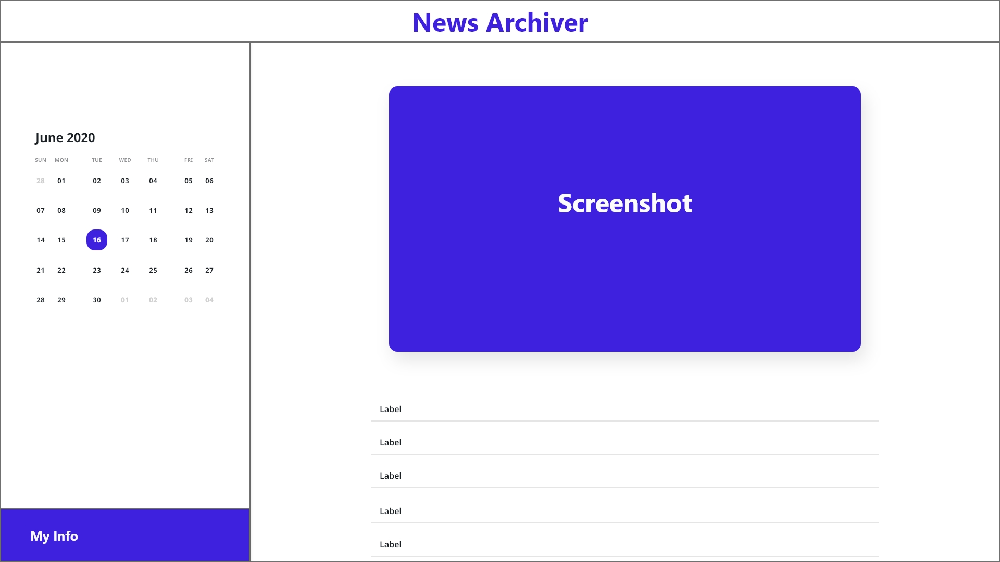

# News Archiver

## Description

This is a **Vue.js** full-stack project I've been working on. I utilise the free tier for Google Cloud APIs and Services that are available on **Firebase**.



## Scenario

Everyday news is kind of overwhelming sometimes. Each time you reload a page, there is a high chance that the headlines are completely different from what you have seen a few minutes ago. Moreovers, filtering the news that matters to you could be time-consuming.

Therefore, I come up with an idea to develop an application that archives the news headlines, theirs URLs and a screenshot of the home page to a cloud storage/database every 15 minutes, so that you can view them all at one place at a time that you are free in the day.

The application involves an underlying **Scheduled Cloud Function** that is executed every 15 minutes and uses **Puppeteer** to scrape data from CNN News. In terms of data, the headlines and URLs are stored in **Firestore**, and the screenshots are stored in **Cloud Storage**.

The source code also includes a client app to view data written in **Vue.js**. I also plan to scale the application with an iOS app when I start learning Swift and Flutter in the future.

---

## My TODOS for Vue

- Install Materialize
- Design Router
- Home page
- Date page
- Navbar Component
- Screenshot Component
- Headlines List Component
- History Mode

## Data Structure

**For Firestore**

```
data: {
    headline: String,
    timestamp: Timestamp,
    url: String
}
```

**For Cloud Storage**

Data are screenshots of the news website with the following naming convention: `cnn-2020-07-27--08-12-42.png`

---

## Tech Stacks

- Node.js
- Firebase (Hosting, Functions, Firestore, Cloud Storage)
- Puppeteer
- Cheerio
- Vue.js
- GCP (App Engine, Cloud Scheduler, Pub/Sub)

---

## Build Setup for Vue.js

``` bash
# install dependencies
npm install

# serve with hot reload at localhost:8080
npm run dev

# build for production with minification
npm run build

# build for production and view the bundle analyzer report
npm run build --report
```

For a detailed explanation on how things work, check out the [guide](http://vuejs-templates.github.io/webpack/) and [docs for vue-loader](http://vuejs.github.io/vue-loader).
